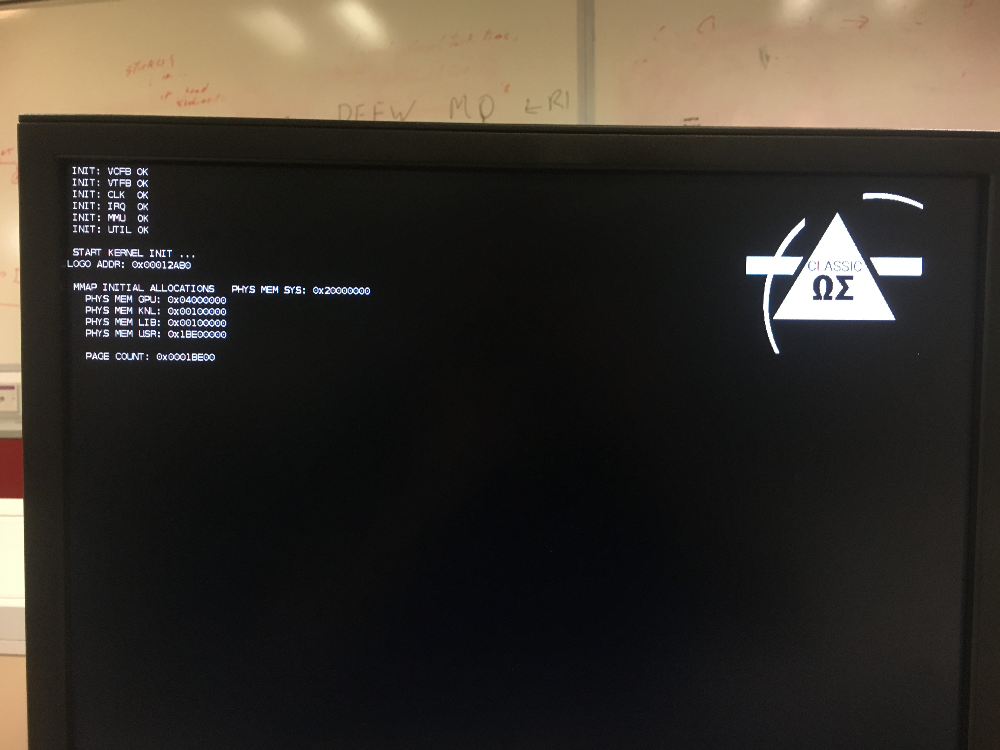

# 

**`Classic`** is a bare-metal **Operating System** developed using [ARM](https://www.arm.com) Assembly and C, for the [Raspberry Pi Zero](https://www.raspberrypi.org/products/raspberry-pi-zero/). The motivation behind **Classic** is to prove simplicity, readability and quality can be achieved when developing an OS.

The main part of the operating system is the [Kernel](https://github.com/thee-engineer/classic.kernel)
