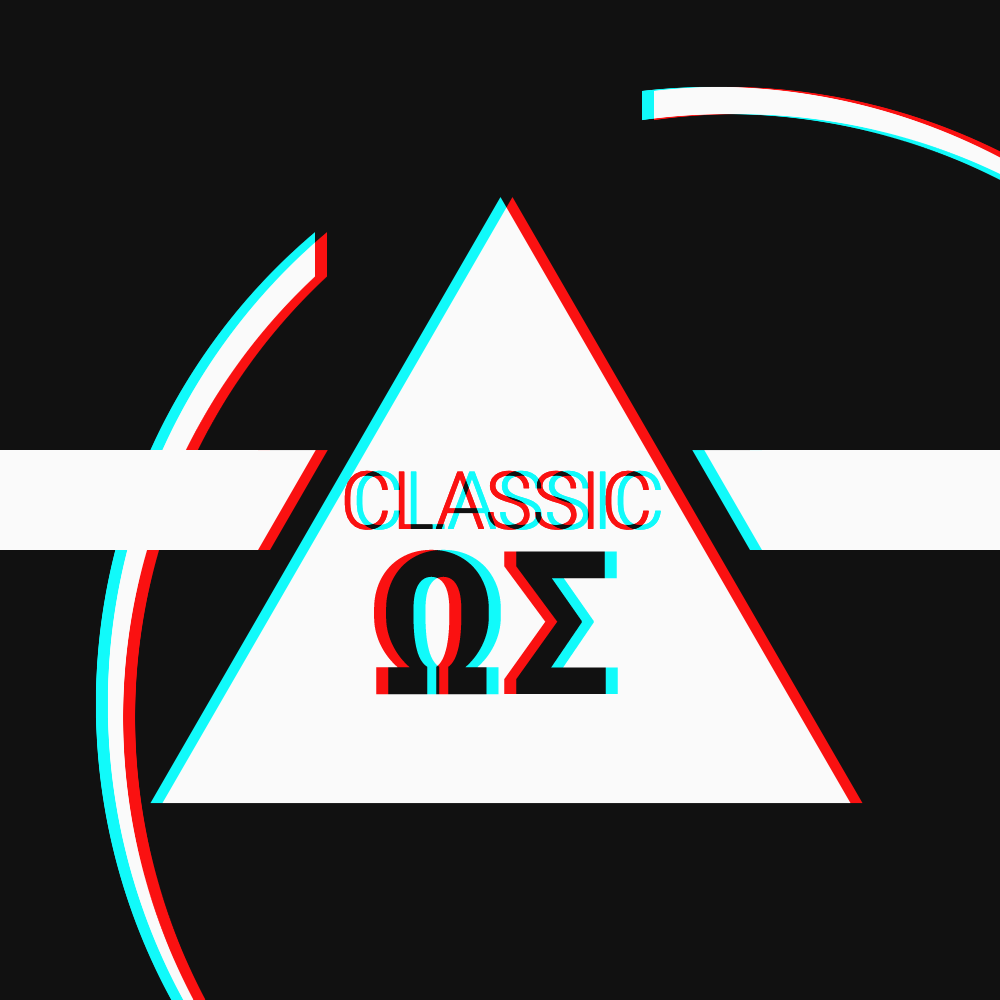

# 

**`Classic`** is a bare-metal **Operating System** developed in [ARM](https://www.arm.com) Assembly for the [Raspberry Pi Zero](https://www.raspberrypi.org/products/raspberry-pi-zero/). The motivation behind **Classic** is to prove simplicity, readability and quality can be achieved when developing an OS.

## Structure

The project is split into multiple modules:

* Kernel
* OS
* Tools
